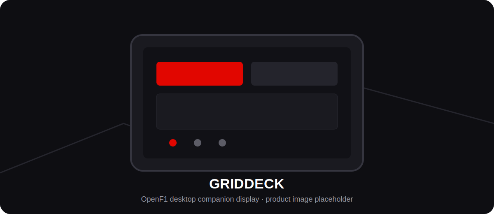
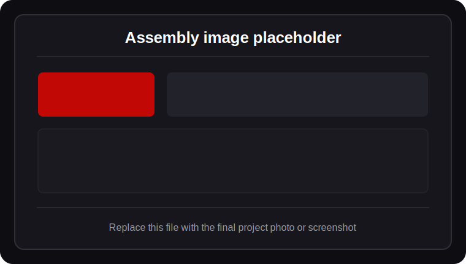
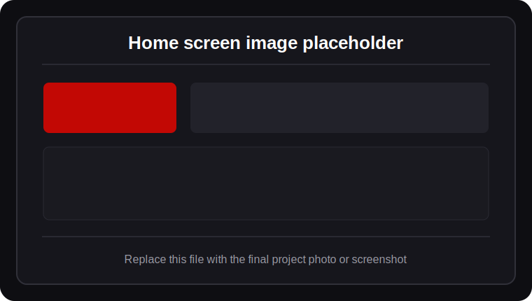
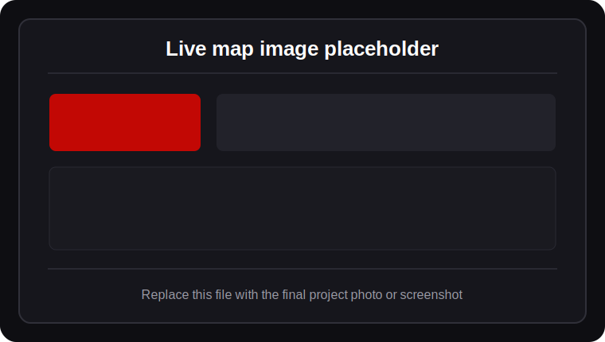
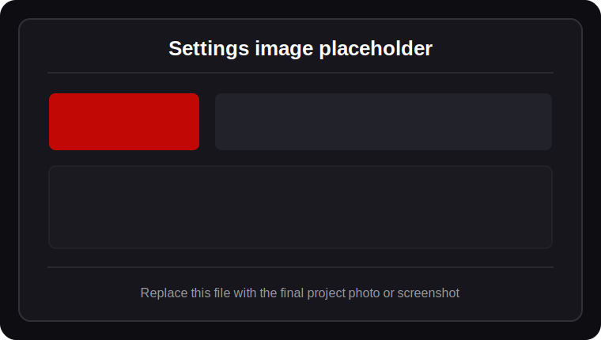

  

<h1 align="center">GridDeck</h1>

  A compact, touch-controlled OpenF1 desktop companion display for live sessions, race weekends, results, standings, weather, radio, and more.

  <strong>OpenF1 Desktop Companion Display</strong> 
  Designed by <strong>The Printing Pilot</strong>

> GridDeck is an independent community project. It is not affiliated with, endorsed by, or officially connected to Formula 1, the FIA, or the OpenF1 project.

## Install GridDeck

The easiest way to get started is with the web installer.

**[Open the GridDeck Web Installer](https://theprintingpilot.github.io/GridDeck/installer/)**

Use Chrome or Edge on desktop, connect your ESP32 screen over USB, and flash GridDeck directly from the browser.

## What is GridDeck?

GridDeck turns a 4.3-inch ESP32-S3 touchscreen into a dedicated motorsport information display for your desk, sim rig, workshop, or streaming setup. It presents OpenF1 data in a purpose-built interface without needing a browser, phone, or computer screen open beside you.

The display is designed to be useful before, during, and after a race weekend. It can show the next session, live timing information, telemetry, track position, pit stops, race control messages, weather, team radio links, season results, championship standings, and historical race data.

## Highlights

- Touch-friendly 480 × 272 interface
- Live timing tower and driver telemetry
- Live track map with moving car positions
- Pit stops and race-control messages
- Track and air conditions
- Team-radio links through scannable QR codes
- Weekend schedule and next-session countdown
- Race, qualifying, starting-grid, and season data
- Driver and constructor championship standings
- Official OpenF1 API or a custom/self-hosted OpenF1 server
- Phone-assisted setup using QR codes
- Dim informational screensaver with clock and next session
- GitHub-based firmware update notifications and on-device OTA installation

## Hardware

GridDeck currently targets the **Guition JC4827W543**:

- ESP32-S3
- 8 MB OPI PSRAM
- 4 MB flash
- 4.3-inch 480 × 272 IPS touchscreen
- NV3041A display controller
- GT911 touch controller

The enclosure, PCB-related information, printable parts, and assembly media will be added to this repository as the project is prepared for release.

  

## Installation

### Browser installer

For most users, the recommended installation method is the browser-based installer:

**[Open the GridDeck Web Installer](https://theprintingpilot.github.io/GridDeck/installer/)**

Requirements:

- Chrome or Edge on desktop
- USB data cable
- Supported ESP32-S3 touchscreen device

If the device is not detected, hold **BOOT** while pressing **RESET**, then try again.

### Manual installation

Manual flashing and development instructions will be expanded as the project documentation is finalized.

## First setup

After booting GridDeck:

1. Open **Settings → WiFi** and connect it to your network.
2. Select your favorite driver, timezone, units, brightness, and screensaver timeout.
3. Leave the data source on the official OpenF1 API, or enable **Custom OpenF1 server**.
4. For a custom server, choose either:
   - the on-screen keyboard, or
   - QR setup from a phone on the same network.
5. Add an OpenF1 account only when the selected data source requires one.

GridDeck stores its settings on the device and restores them after restarts and firmware updates.

## Using GridDeck

The bottom navigation bar provides five main areas:

### Home

A quick race-weekend overview with the next session, countdown, favorite-driver information, conditions, and useful status information.

  

### Live

Live-session tools including the timing tower, selected-driver telemetry, track map, pit stops, race control, weather, and team radio.

  

### Data

Weekend calendar, race results, qualifying results, starting grid, historical seasons, comparisons, and other non-live information.

### Points

Driver and constructor championship standings, including quick access to your selected favorite driver.

### Settings

Wi-Fi, data source, OpenF1 account, favorite driver, firmware updates, brightness, units, timezone, and screensaver behavior.

  

## Firmware updates

GridDeck checks the latest published GitHub Release after startup and periodically while connected to Wi-Fi. It never installs an update without permission.

When a newer release is available, the display shows:

- installed and available versions
- a short release summary
- **Update now** and **Later** options

During installation, GridDeck downloads the release over HTTPS, verifies its SHA-256 checksum, writes it to the inactive OTA slot, and restarts only after validation succeeds. A failed download or checksum verification leaves the installed firmware unchanged.

A manual check is available under **Settings → Firmware update**.

## Data sources

GridDeck supports:

- the public OpenF1 API
- a compatible custom or self-hosted OpenF1 server

Some live and historical datasets depend on what the selected server has ingested or backfilled. Empty screens do not always indicate a device problem; the requested dataset may not yet exist on that server.

## Project status

GridDeck is under active development. The interface, firmware update path, installation workflow, enclosure files, and documentation may change as the public release is prepared.

Current focus:

- validate OTA firmware size on the final build
- test updates across multiple release versions
- refine the web installer flow
- add final product photos and UI screenshots
- publish enclosure and assembly documentation

## Support and feedback

Use GitHub Issues for reproducible firmware problems, installation problems, feature requests, and documentation corrections. Include the GridDeck firmware version, board version, data source, and relevant serial logs when reporting a problem.
