

  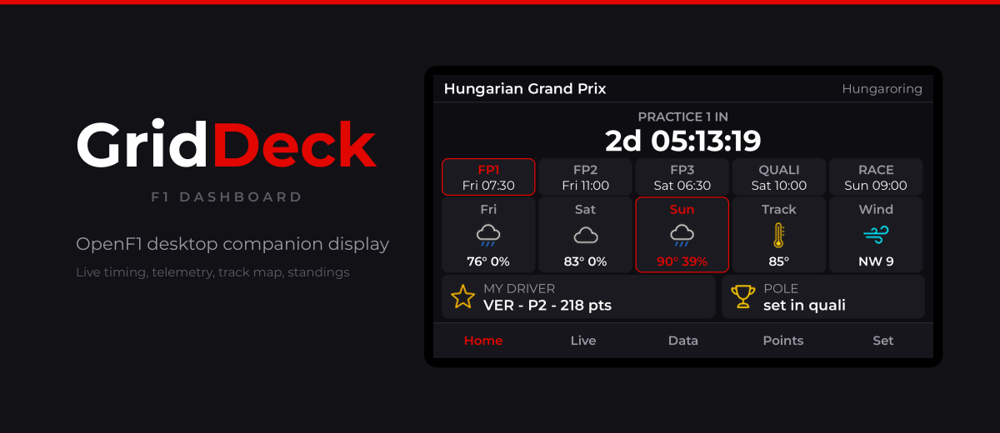

<h1 align="center">GridDeck</h1>

  

     
     

  

  

    
  

  A compact, touch-controlled OpenF1 desktop companion display for live sessions, race weekends, results, standings, weather, radio, and more.

  <strong>OpenF1 Desktop Companion Display</strong> 
  Designed by <strong>The Printing Pilot</strong>

> GridDeck is an independent community project. It is not affiliated with, endorsed by, or officially connected to Formula 1, the FIA, or the OpenF1 project.

## Install GridDeck

The easiest way to get started is with the web installer.

**[Open the GridDeck Web Installer](https://theprintingpilot.github.io/GridDeck/installer/)**

Use Chrome or Edge on desktop, connect your ESP32 screen over USB, and flash GridDeck directly from the browser.

## What is GridDeck?

GridDeck turns a 4.3-inch ESP32-S3 touchscreen into a dedicated motorsport information display for your desk, sim rig, workshop, or streaming setup. It presents OpenF1 data in a purpose-built interface without needing a browser, phone, or computer screen open beside you.

The display is designed to be useful before, during, and after a race weekend. It can show the next session, live timing information, telemetry, track position, pit stops, race control messages, weather, team radio links, season results, championship standings, and historical race data.

**GridDeck uses both the free or paid version of OpenF1 API:**
On the free API, GridDeck does everything except live —
countdown, schedule, weather, standings, results, news — with each session's data
appearing about 30 minutes after it ends. Paid unlocks the race as it happens: live
timing tower, telemetry, moving track map, pit stops, flag alerts and fastest-lap
banners. Same screens either way; you're paying only for real time.

## Highlights

- Touch-friendly 480 × 272 interface
- Live timing tower and driver telemetry
- Live track map with moving car positions
- Pit stops and race-control messages
- Track and air conditions
- Team-radio links through scannable QR codes
- Weekend schedule and next-session countdown
- Race, qualifying, starting-grid, and season data
- Driver and constructor championship standings
- Official OpenF1 API or a custom/self-hosted OpenF1 server
- Phone-assisted setup using QR codes
- Dim informational screensaver with clock and next session
- GitHub-based firmware update notifications and on-device OTA installation

## Hardware
**BOM:** (Affiliate Links)

Needed:
- 1x - Guition JC4827W543 - **[Link](https://s.click.aliexpress.com/e/_c3Ar44ER)**
- 8x - 6x3mm Magents - **[Link](https://s.click.aliexpress.com/e/_c3qP6N2t)**
- 4x - M3x5mm Screws - **[Link](https://s.click.aliexpress.com/e/_oogbRPM)**
- 6x - M3xL4xOD5 Thread Inserts - **[Link](https://s.click.aliexpress.com/e/_c2Iun0o1)**
- 1x - Internal Flat Ribbon USB C Cable (T9C-T8T-NC 20P) - **[Link](https://s.click.aliexpress.com/e/_c3w9gEZ5)** 

Optinal:
- 1x - Battery - **[Link](https://s.click.aliexpress.com/e/_c4aTvomf)**
- 1x - 2535 3W 4Ω Speaker - **[Link](https://s.click.aliexpress.com/e/_c4oY1EY7)**

3D Printed Parts:
- Printables - **[Link](update)**
- Makerworld - **[Link](update)**

  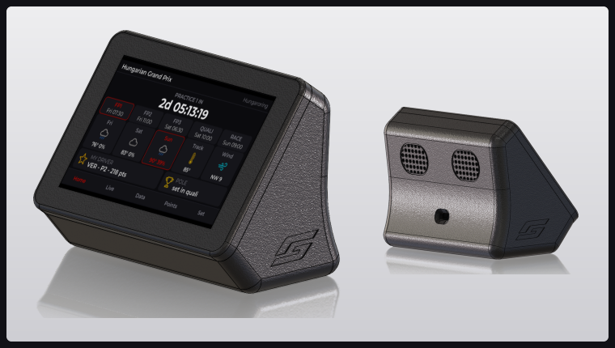

## Installation

### Browser installer

For most users, the recommended installation method is the browser-based installer:

**[Open the GridDeck Web Installer](https://theprintingpilot.github.io/GridDeck/installer/)**

Requirements:

- Chrome or Edge on desktop
- USB data cable
- Supported ESP32-S3 touchscreen device

If the device is not detected, hold **BOOT** while pressing **RESET**, then try again.

## First setup

After booting GridDeck:

1. Open **Settings → WiFi** and connect it to your network.
2. Select your favorite driver, timezone, units, brightness, and screensaver timeout.
3. Leave the data source on the official OpenF1 API, or enable **Custom OpenF1 server**.
4. For a custom server, choose either:
   - the on-screen keyboard, or
   - QR setup from a phone on the same network.
5. Add an OpenF1 account only when the selected data source requires one.

GridDeck stores its settings on the device and restores them after restarts and firmware updates.

## Using GridDeck

The bottom navigation bar provides five main areas:

### Home

A quick race-weekend overview with the next session, countdown, favorite-driver information, conditions, and useful status information.

  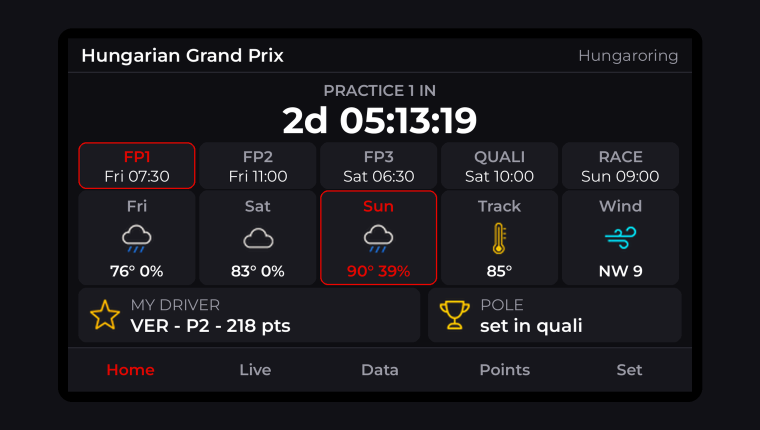

### Live

Live-session tools. The hub opens eight views covering timing, telemetry, track
position, strategy and conditions.

  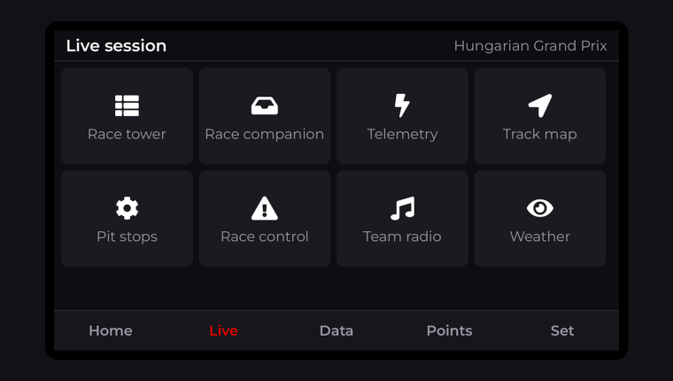

#### Race tower

The full running order with position, driver, gap and current tyre compound. A
coloured bar across the top carries the active flag and the lap count. When no
session is live it shows the last completed session's classification.

  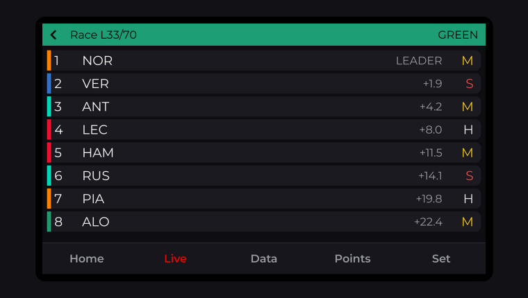

#### Race companion

The field on the left with your favourite driver highlighted, and a detail panel
for whoever is selected. Tap any driver to switch the panel to their gap, lap
times, tyre age, speed, gear and DRS. A purple marker shows who holds the
session's fastest lap.

  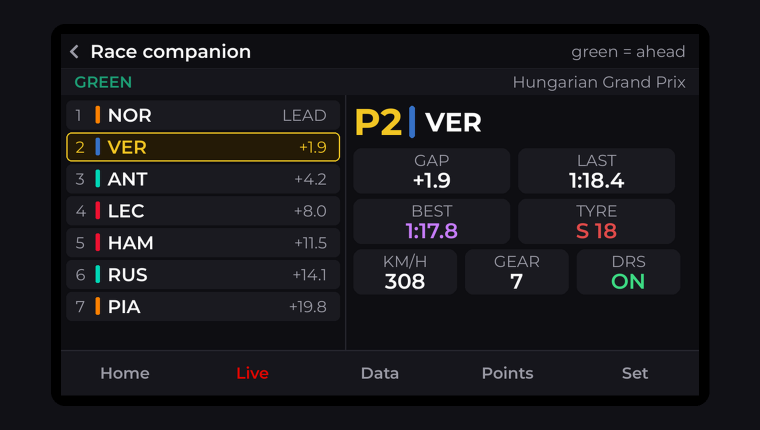

#### Telemetry

Live car data for one driver: speed, throttle, brake, gear, RPM and DRS, with
last and best lap underneath. Use the arrows to step through the field.

  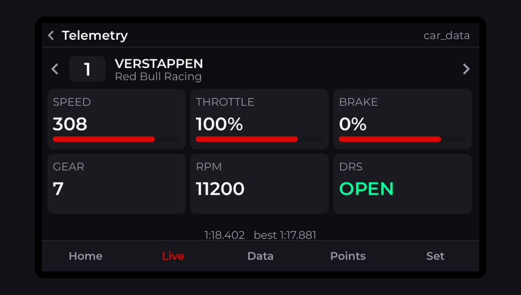

#### Track map

The circuit outline drawn from live location data, with every car shown in its
team colour. The outline is learned during a session and reused afterwards.

  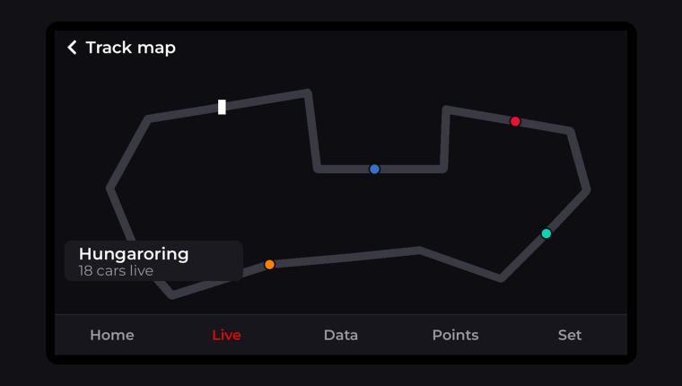

#### Pit stops

Every stop in the session, newest first, showing the lap, the driver, the tyre
change and the stationary time.

  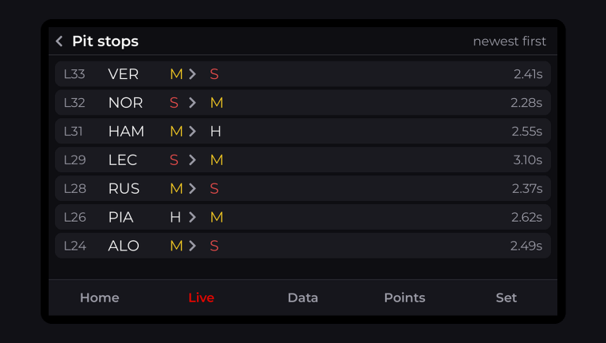

#### Race control

Official race control messages in order, including flags, penalties, DRS status
and safety car calls.

  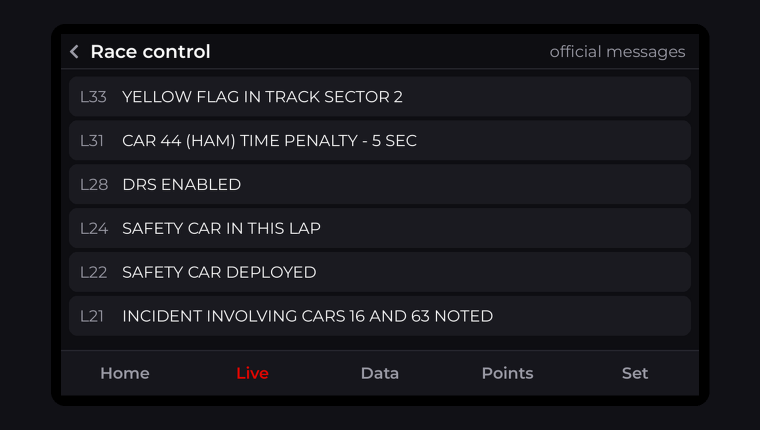

#### Team radio

Radio clips from the session, newest first. Tap one to play it through the
onboard speaker, or open the QR code to listen on your phone.

  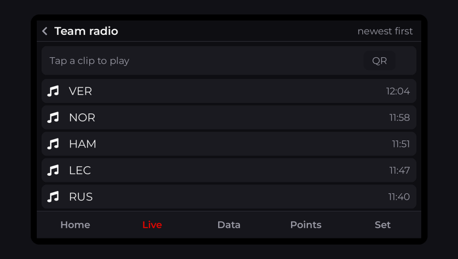

#### Weather

Conditions measured at the circuit: air and track temperature, humidity, wind,
pressure and rainfall, with the forecast summary underneath.

  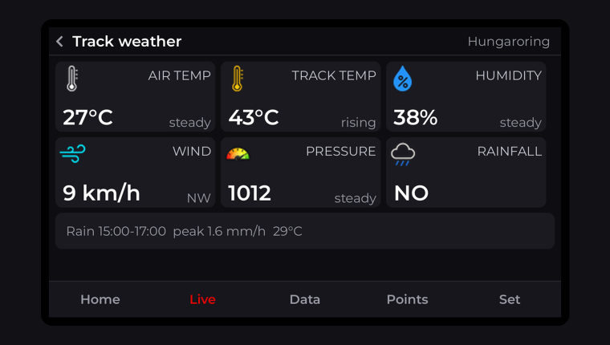

### Data

Weekend calendar, race results, qualifying results, starting grid, historical seasons, comparisons, and other non-live information.

### Points

Driver and constructor championship standings, including quick access to your selected favorite driver.

### Settings

Wi-Fi, data source, OpenF1 account, favorite driver, firmware updates, brightness, units, timezone, and screensaver behavior.

  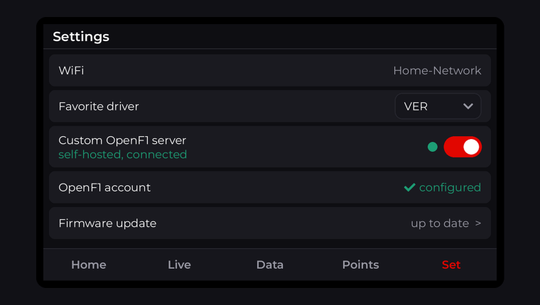

## Firmware updates

GridDeck checks the latest published GitHub Release after startup and periodically while connected to Wi-Fi. It never installs an update without permission.

When a newer release is available, the display shows:

- installed and available versions
- a short release summary
- **Update now** and **Later** options

During installation, GridDeck downloads the release over HTTPS, verifies its SHA-256 checksum, writes it to the inactive OTA slot, and restarts only after validation succeeds. A failed download or checksum verification leaves the installed firmware unchanged.

A manual check is available under **Settings → Firmware update**.

## Data sources

GridDeck supports:

- the public OpenF1 API (OpenF1 Subscription needed for Live data page)
- a compatible custom or self-hosted OpenF1 server

## Project status

GridDeck is under active development. The interface, firmware update path, installation workflow, enclosure files, and documentation may change as the public release is prepared.

Current focus:

- validate OTA firmware size on the final build
- test updates across multiple release versions
- add final product photos and UI screenshots
- publish enclosure and assembly documentation

## Support and feedback

Use GitHub Issues for reproducible firmware problems, installation problems, feature requests, and documentation corrections. Include the GridDeck firmware version, board version, data source, and relevant serial logs when reporting a problem.
